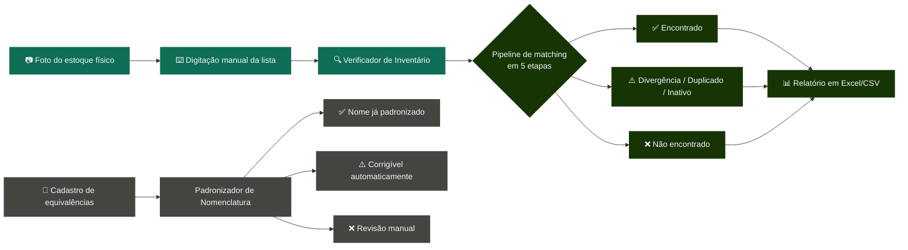
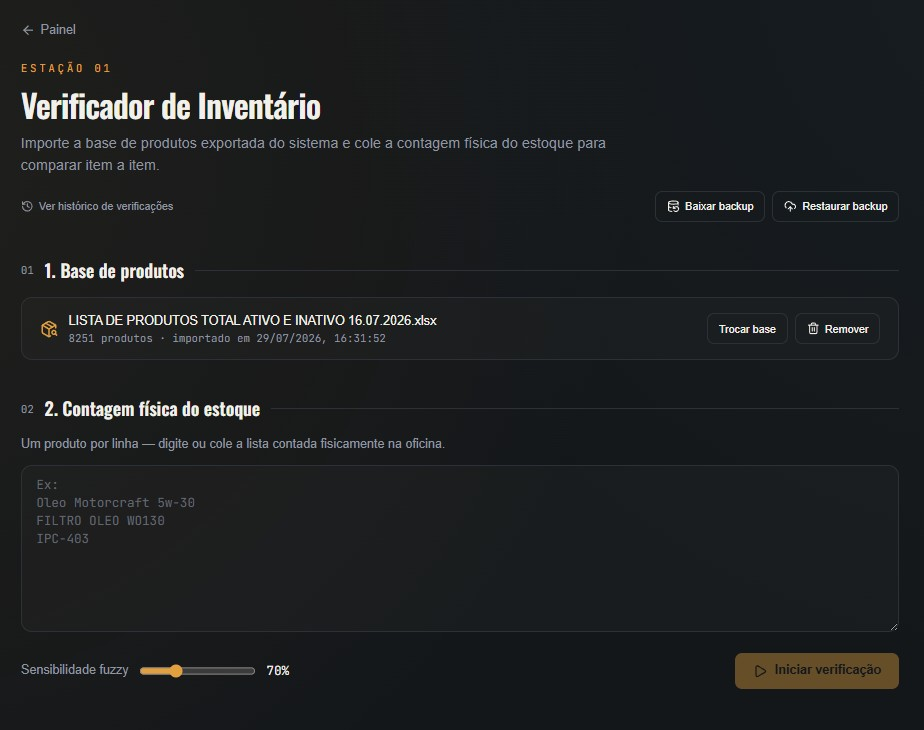
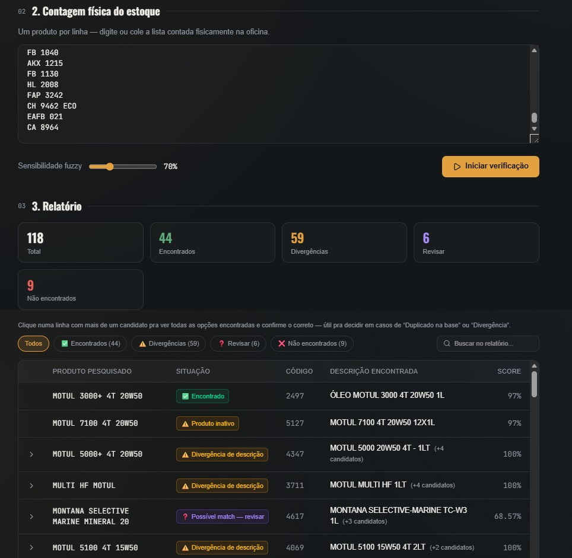

<div align="center">


# 🛠️ Painel de Cadastro de Produtos

### Verificador de inventário + padronizador de nomenclatura, criado para acabar com a bagunça de nomes duplicados no cadastro de produtos

<br>

[](https://painel-cadastro-produtos.vercel.app/)
[](https://github.com/raelmz/painel-cadastro-produtos)

<br>


</div>


## 📑 Índice

`O problema` · `Como resolve` · `Capturas de tela` · `Funcionalidades` · `Stack` · `Como usar` · `Estrutura` · `Rodando localmente` · `Deploy` · `Decisões técnicas` · `Roadmap` · `Licença` · `Autor`


## O problema

> Este projeto nasceu de uma dor real: uma oficina mecânica de pequeno
> porte tinha centenas de produtos cadastrados no sistema de gestão com
> o **mesmo item escrito de formas diferentes** — `ELEMENTO FILTRANTE
> H100`, `FILTRO LUBRIFICANTE H100` e `FILTRO DE OLEO H100` no cadastro,
> todos o mesmo produto físico.

Isso gerava duplicidade de cadastro, estoque contado errado, dificuldade
pra conferir o inventário físico contra o sistema, e retrabalho manual
toda vez que alguém tentava organizar a base. Como oficina, o volume de
peças e óleos com nomes técnicos (marca + viscosidade + certificação +
embalagem, tudo digitado à mão a partir de uma foto do produto) tornava
esse problema difícil de resolver "no olho".

**Esse tipo de problema não é exclusivo de oficina.** Qualquer negócio
com catálogo de produtos alimentado por mais de uma pessoa — farmácia,
mercado, loja de peças, distribuidora, e-commerce — sofre da mesma
inconsistência de nomenclatura. O projeto foi construído de forma
genérica o suficiente (dicionário de equivalências configurável pelo
próprio usuário, sem nada "hardcoded" de óleo automotivo no motor de
matching) para ser adaptado a qualquer outro setor.

<div align="right"><a href="#-índice">⬆ voltar ao topo</a></div>


## Como resolve

Duas ferramentas complementares, pensadas pro fluxo real de quem confere
estoque na prática (contagem física por foto → digitação manual → conferência):



- **Verificador de Inventário** — importa a base de produtos (Excel/CSV)
  e compara contra a contagem física do estoque, apontando divergências,
  duplicados, itens inativos e não encontrados. Pipeline de matching em
  5 etapas (exato → substring alfanumérico → partial ratio → substring
  espaçado → fuzzy), com auditoria de todos os candidatos encontrados
  por item, não só o melhor — e confirmação manual direto na tela.
- **Padronizador de Nomenclatura** — cadastro de equivalências de nome
  (ex: `ELEMENTO FILTRANTE H100` / `FILTRO LUBRIFICANTE H100` →
  `FILTRO DE ÓLEO H100`) e validação em lote contra regras de escrita
  padrão (maiúsculas, acentos, unidade de embalagem etc.), evitando
  produtos duplicados no cadastro.

> Reescrita em TypeScript/Next.js de um app Python/Streamlit anterior —
> mesmo problema, agora como site publicável.

<div align="right"><a href="#-índice">⬆ voltar ao topo</a></div>


## Capturas de tela

<div align="center">
<table>
<tr>
<td width="50%" valign="top">

**Importação da base + contagem física**



</td>
<td width="50%" valign="top">

**Relatório com divergências e candidatos**



</td>
</tr>
</table>
</div>

<div align="right"><a href="#-índice">⬆ voltar ao topo</a></div>


## Funcionalidades

<table>
<tr>
<td width="33%" valign="top">

**🔍 Matching em 5 etapas**
Exato → substring alfanumérico → partial ratio → substring espaçado → fuzzy, com bônus/penalidade por viscosidade e stopwords técnicas.

</td>
<td width="33%" valign="top">

**🕵️ Auditoria de candidatos**
Cada item mostra até 5 candidatos encontrados (não só o melhor), com código, descrição, status e score — e botão de confirmar o certo.

</td>
<td width="33%" valign="top">

**📊 Exportação Excel formatada**
Relatório `.xlsx` com abas de resultado completo, pendências e resumo, cores por status, auto-filtro e cabeçalho estilizado.

</td>
</tr>
<tr>
<td width="33%" valign="top">

**🔎 Filtro e busca no relatório**
Chips por status (encontrado/divergência/revisar/não encontrado) e busca livre, sem precisar rodar a verificação de novo.

</td>
<td width="33%" valign="top">

**📖 Dicionário de equivalências**
Cadastro de sinônimos por regex, aplicado antes das regras de padronização — resolve o caso central do projeto.

</td>
<td width="33%" valign="top">

**💾 Backup/restore em JSON**
Exporta e reimporta base + sinônimos + históricos, protegendo contra perda de dados sem precisar de banco.

</td>
</tr>
<tr>
<td width="33%" valign="top">

**📈 Dashboard de histórico**
Tela dedicada com o histórico de todas as verificações e padronizações já executadas.

</td>
<td width="33%" valign="top">

**🧩 Sem backend**
Tudo roda no navegador — leitura de planilha, matching e persistência (`localStorage`). Zero custo de infraestrutura.

</td>
<td width="33%" valign="top">

**🧱 Motor genérico**
Nada de "óleo automotivo" no código do matching — o vocabulário do negócio vive só no dicionário de equivalências configurável.

</td>
</tr>
</table>

<div align="right"><a href="#-índice">⬆ voltar ao topo</a></div>


## Stack

<div align="center">


</div>

| Camada | Tecnologia | Papel no projeto |
|---|---|---|
| Framework | **Next.js 15** (App Router) + TypeScript | Front-end e "back-end" (não há back-end de verdade) |
| Estilo | **Tailwind CSS v4** | Tema visual próprio ("oficina": grafite + acento âmbar/aço) |
| Leitura de planilha | **SheetJS (`xlsx`)** + **PapaParse** | Importa a base de produtos em Excel/CSV, direto no navegador |
| Exportação formatada | **ExcelJS** | Gera o relatório `.xlsx` com cor por status, auto-filtro e abas |
| Matching fuzzy | **`fastest-levenshtein`** | Motor de similaridade de texto do pipeline de matching |
| Ícones | **`lucide-react`** | Ícones da interface |
| Persistência | **`localStorage`** do navegador | Sem banco, sem servidor — ver seção "Decisões técnicas" |
| Deploy | **Vercel** | Publicado a partir de um repositório no GitHub |

<div align="right"><a href="#-índice">⬆ voltar ao topo</a></div>


## Como usar

### Verificador de Inventário

1. Importe a base de produtos exportada do sistema (Excel ou CSV) —
   confirme qual coluna é código, qual é descrição e (opcional) qual
   indica se o produto está ativo.
2. Cole a contagem física do estoque, um produto por linha.
3. Ajuste a sensibilidade do fuzzy matching se quiser (padrão: 70%).
4. Clique em **Iniciar verificação** e revise o relatório — cada linha
   mostra se o item foi encontrado, tem divergência de descrição, está
   duplicado na base, inativo, ou não foi encontrado. Use os **filtros
   por status** e a **busca** pra navegar rápido num relatório grande.
5. Linhas com mais de um candidato ficam clicáveis (▸) e mostram todas
   as opções encontradas — código, descrição, se está ativo e o score
   de cada uma. Clique em **Confirmar** no candidato certo pra marcar a
   decisão direto na tela.
6. Exporte o relatório em **Excel** (formatado, com abas de resultado
   completo/pendências/resumo) ou **CSV**.
7. Use **Baixar backup** periodicamente pra não perder a base e o
   histórico se limpar o navegador ou trocar de computador.

### Padronizador de Nomenclatura

1. Cadastre as equivalências de nome do seu negócio no **Dicionário de
   equivalências** — por exemplo, pra unificar três formas de escrever
   o mesmo filtro:

   | Padrão (regex)                  | Substituição       |
   |----------------------------------|---------------------|
   | `\bELEMENTO FILTRANTE\b`         | `FILTRO DE ÓLEO`    |
   | `\bFILTRO LUBRIFICANTE\b`        | `FILTRO DE ÓLEO`    |

   (`FILTRO DE OLEO` já vira `FILTRO DE ÓLEO` automaticamente pela regra
   de acentuação, sem precisar de equivalência.)

2. Cole a lista de descrições a validar, uma por linha.
3. Clique em **Validar lista** — cada linha mostra se já está no padrão
   (✅), se dá pra corrigir automaticamente (⚠️) ou se precisa de
   revisão manual (❌), junto com a sugestão de descrição corrigida.
4. Exporte o relatório em CSV.

### Histórico

Acesse a tela de **Histórico** (link no topo do Verificador) pra ver
todas as verificações e padronizações já executadas, com data e
contagem por status.

<div align="right"><a href="#-índice">⬆ voltar ao topo</a></div>


## Estrutura

```text
src/
  app/
    page.tsx                  → Tela inicial (2 botões: Verificador / Padronizador)
    layout.tsx                → Layout raiz, fontes, metadata
    globals.css                → Tema visual (tokens de cor, Tailwind v4)
    verificador/page.tsx        → Tela do Verificador de Inventário
    padronizador/page.tsx        → Tela do Padronizador de Nomenclatura
    historico/page.tsx            → Dashboard de histórico (verificações + padronizações)
  components/
    ToolHeader.tsx                 → Cabeçalho padrão das telas de ferramenta
    StatusBadge.tsx                 → Selo colorido de situação (✅ ⚠️ ❌ ❓)
  lib/
    textUtils.ts                     → Normalização de texto e unidades de medida
    matching.ts                       → Motor de busca: exato / substring / partial ratio / fuzzy
    padronizador.ts                    → Regras de padronização + equivalências
    fileParser.ts                       → Leitura tolerante de Excel/CSV
    storage.ts                           → Persistência em localStorage + backup/restore em JSON
    exportExcel.ts                        → Exportação do relatório em .xlsx formatado
public/
  1.jpg                                    → Captura de tela: importação da base + contagem física
  2.jpg                                    → Captura de tela: relatório com divergências e candidatos
LICENSE                            → Licença MIT
```

<div align="right"><a href="#-índice">⬆ voltar ao topo</a></div>


## Rodando localmente

Pré-requisito: [Node.js](https://nodejs.org) 18 ou mais recente.

```bash
git clone https://github.com/raelmz/painel-cadastro-produtos.git
cd painel-cadastro-produtos
npm install
npm run dev
```

Abre em `http://localhost:3000`.

### Build de produção

```bash
npm run build
npm start
```

> Nota: o build usa `next/font/google` para carregar as fontes (Oswald,
> Inter, JetBrains Mono), o que exige acesso à internet no momento do
> build. Funciona normalmente em qualquer máquina com internet e na
> Vercel.

### Checagem de qualidade

```bash
npx tsc --noEmit     # checagem de tipos
npx eslint src        # lint
```

Ambos devem rodar sem erros antes de qualquer commit.

<div align="right"><a href="#-índice">⬆ voltar ao topo</a></div>


## Deploy

Publicado via **Vercel**, direto a partir da branch `main`:

🔗 **[painel-cadastro-produtos.vercel.app](https://painel-cadastro-produtos.vercel.app/)**

Para publicar sua própria versão:

1. Suba o repositório para o GitHub.
2. Crie uma conta em [vercel.com](https://vercel.com) (pode entrar com a
   conta do GitHub).
3. Clique em **Add New → Project** e selecione o repositório.
4. A Vercel detecta automaticamente que é um projeto Next.js — não
   precisa mudar nenhuma configuração. Clique em **Deploy**.
5. Toda vez que você der `git push` na branch `main`, a Vercel publica
   a nova versão automaticamente (preview em pull requests, produção
   na `main`).

<div align="right"><a href="#-índice">⬆ voltar ao topo</a></div>


## Decisões técnicas

- **Sem banco de dados / sem backend** — todos os dados (base de
  produtos, dicionário de equivalências, histórico) ficam no
  `localStorage` do navegador. Escolha deliberada pra manter o projeto
  simples e sem custo de infraestrutura — trade-off: dados não são
  compartilhados entre pessoas/computadores diferentes, e limpar o
  navegador apaga tudo. O recurso de **backup/restore em JSON** existe
  justamente pra mitigar esse risco sem precisar de banco.
- **Pipeline de matching em 5 etapas, não um fuzzy único** — um match
  exato ou por substring é mais confiável (e mais rápido) que fuzzy;
  cada etapa só roda se a anterior não achou nada, e o fuzzy (último
  recurso) tem camadas extras de correção (viscosidade como quase-ID do
  produto, stopwords técnicas ignoradas, teto pra coincidência de número
  solto) pra reduzir falso positivo/negativo.
- **Dicionário de equivalências configurável pelo usuário**, em vez de
  regras fixas de nomenclatura — é o que torna o projeto adaptável a
  qualquer catálogo de produtos, não só óleo automotivo.
- **Next.js + TypeScript + Vercel** — build simples, deploy automático a
  cada push, sem servidor próprio pra manter.

<div align="right"><a href="#-índice">⬆ voltar ao topo</a></div>


## Roadmap

- [ ] Persistir a confirmação de candidato entre sessões
- [ ] Peso diferenciado pra tokens técnicos (viscosidade/certificação/volume) no fuzzy
- [ ] Teste de regressão automatizado do motor de matching
- [ ] Fila de cadastro pendente pra itens não encontrados
- [ ] Fallback semântico (embeddings) como última camada do matching

<div align="right"><a href="#-índice">⬆ voltar ao topo</a></div>


## Licença

Distribuído sob a licença **MIT** — veja [`LICENSE`](./LICENSE) para o
texto completo. Pode ser usado, copiado, modificado e adaptado
livremente, inclusive para resolver o mesmo problema de nomenclatura em
outros setores/empresas.


## Autor

<div align="center">

Desenvolvido por **Israel Menezes**, criado enquanto trabalhava diretamente no estoque de uma oficina mecânica — a dor de conferir o inventário físico contra um cadastro cheio de nomes duplicados era minha, no dia a dia, e o projeto nasceu pra resolver o próprio trabalho.

[](https://github.com/raelmz)
[](https://www.linkedin.com/in/israel-menezes-perfil/)
[](https://raeldev.vercel.app)

</div>

